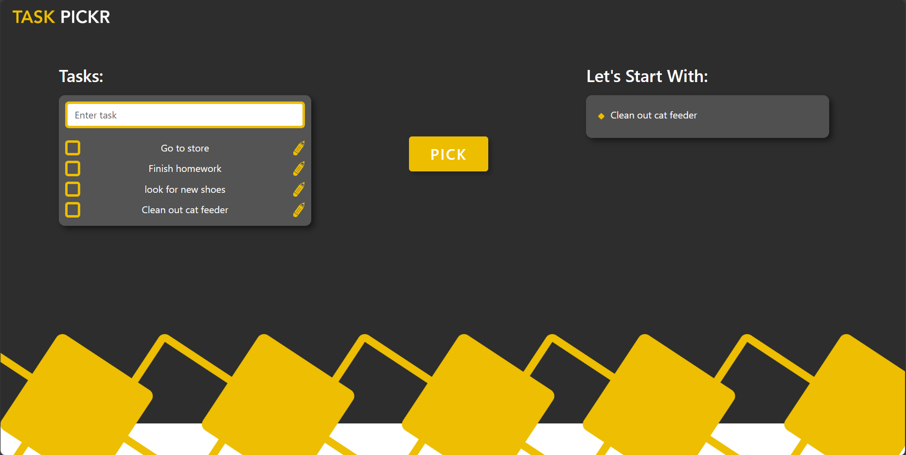

# TASK PICKR (Redesign)
This is a redesign of my first Task Pickr app. The design has been simplified and recoded using React. Instead of two lists in Tasks, it now has one. Also, the ability to edit tasks was added.

As this was a front-end project, data is not stored in a database, so it will refresh once the page reloads.

Live Demo: https://taskpickr.netlify.app/

## Technologies Used
React, Bootstrap, HTML/CSS
 
## Images

Current Design

Old Design

